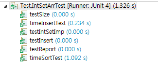
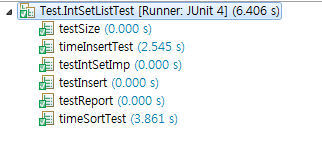
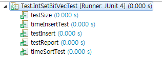
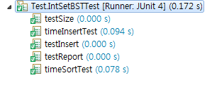
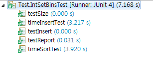

# DevSet3

 # Insert & Sorting Test

 50,000개의 값을 역순으로 Insert하여 Sorting하는데 소요 시간 비교
 
 <h3> IntSetArr </h3>

  

  <h3> IntSetList </h3>

  

 <h3> IntSetBitVec </h3>

  
  > 가장 빠른 속도

 <h3> IntSetBST </h3>

  
  > 노드 갯수가 20,000를 넘어갈 경우 Stack Overflow가 발생하여 10,000개의 값으로 Test를 진행.

 <h3> IntSetBins </h3>

  

# Conclusion
BitVec가 가장 빠른 속도의 Test 결과를 보여주었다. 그에 반에 해쉬 맵 기반의 Bins는 가장 느린 속도를 보였다.
